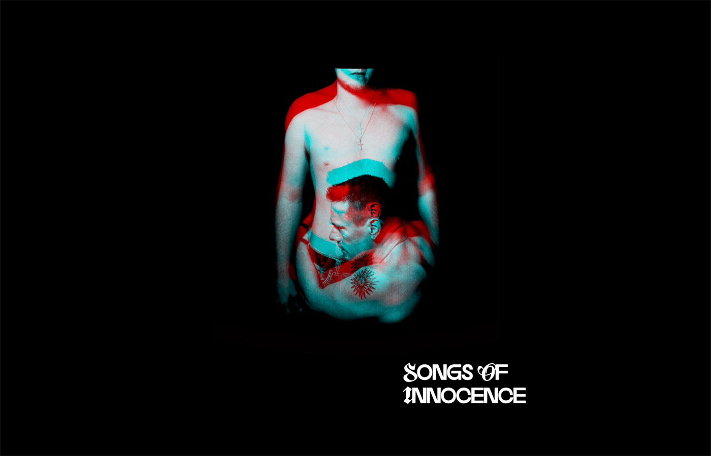

# U2 Discography built with Three js

This project has been deployed and can be viewed <a href='https://threejs-u2-discography.vercel.app/' target='_blank'>here.</a>

This application shows the discography of U2 with an RGB split effect on the album artworks which was created with <a href='https://threejs.org/' target='_blank'>Three.js.</a> The application is hosted with <a href='https://vercel.com' target='_blank'>Vercel</a>

## Technologies Used

### Languages

- [HTML5](https://en.wikipedia.org/wiki/HTML5)
- [CSS3](https://en.wikipedia.org/wiki/CSS)
- [JavaScript](https://en.wikipedia.org/wiki/JavaScript) -[GLSL](https://developer.mozilla.org/en-US/docs/Games/Techniques/3D_on_the_web/GLSL_Shaders)

### Libraries, frameworks, databases and editors

- [Github](https://github.com/) - Where the repo for this project is located.
- [Git](https://git-scm.com/book/en/v2/Getting-Started-About-Version-Control) - Version control used throughout the development process.
- [Three.js](https://threejs.org/) - Used to create the 3D RGB animation using WebGL.
- [Vercel](https://vercel.com) - Platform used to deploy and host the application.

### Tools

- [Parcel JS](https://parceljs.org/) - Used for compiling JavaScript files.
